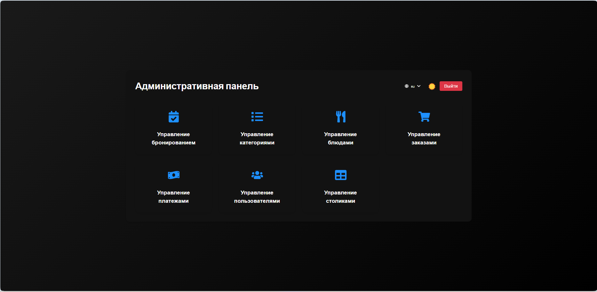
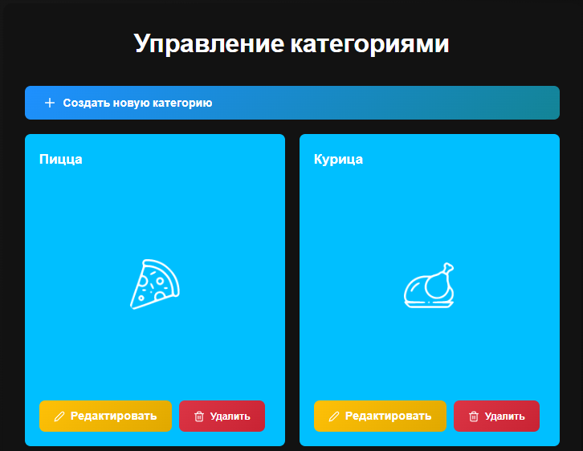
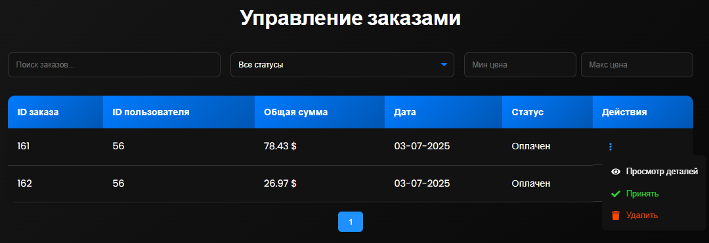
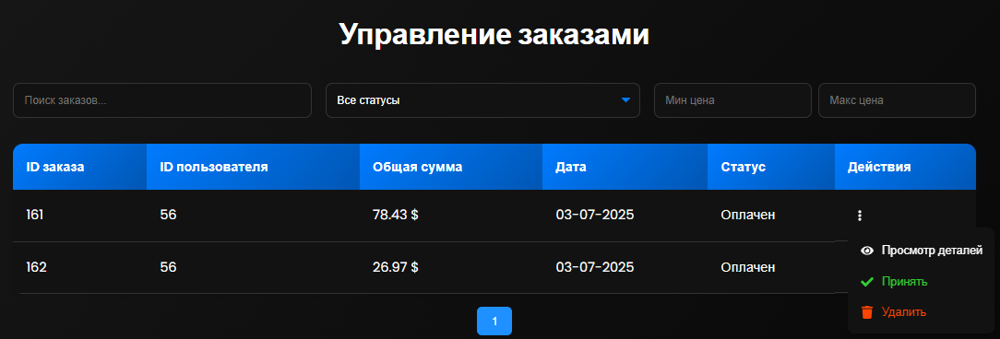
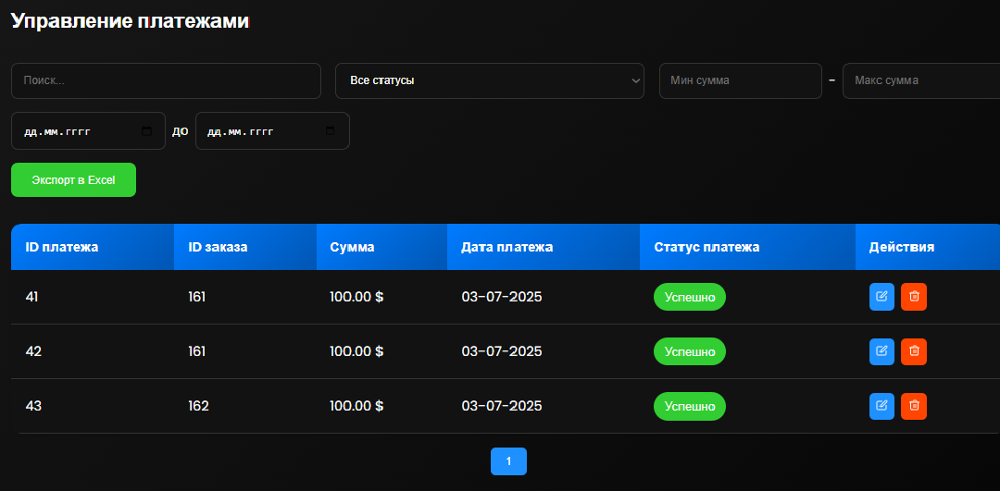
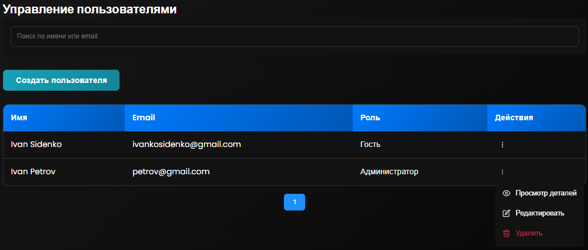
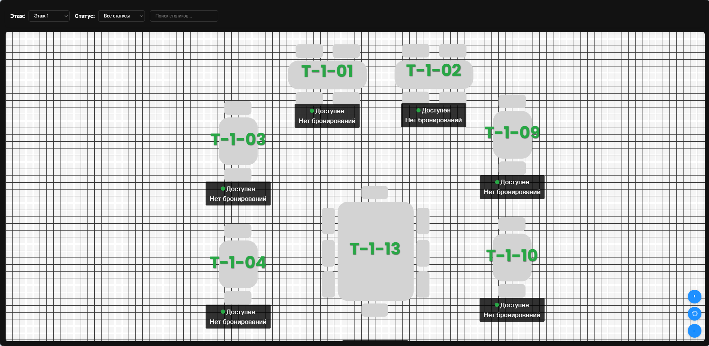

# 🍽 Restaurant Management — Admin Website

## 📌 Описание проекта

**Restaurant Management — Admin Website** — это административная панель для управления рестораном. Проект является **административной частью** системы и взаимодействует с [Backend](https://github.com/IvankoSidan/restaurant-management-server), реализованным на **Spring Boot**.

Backend использует **Yandex API** для мультиязычности, а интерфейс поддерживает **светлую и тёмную тему**.

С помощью этой панели администратор может:

* Управлять административной панелью
* Управлять бронированиями
* Управлять категориями
* Управлять блюдами
* Управлять заказами
* Управлять платежами
* Управлять пользователями
* Управлять столиками

---

## 🎯 Цель проекта

Создать удобный и функциональный инструмент для администраторов ресторана, позволяющий в реальном времени управлять процессами заведения.

---

## 🖥 Демонстрация работы 👉 [Смотреть работу React--website-клиента](https://drive.google.com/file/d/1Q_hhzoljGuwQXonhGUoZrzY-U9Stpg6_/view?usp=sharing)

Примеры скринов:










---

## 🏗 Архитектура проекта

Проект построен по **модульной архитектуре** с разделением на слои:

* **`api/`** — модуль для работы с REST API (axios)
* **`components/`** — переиспользуемые UI-компоненты
* **`context/`** — глобальное состояние через React Context API
* **`data/`** — DTO, модели и перечисления
* **`hooks/`** — кастомные React-хуки
* **`pages/`** — страницы приложения
* **`styles/`** — глобальные и модульные стили
* **`utils/`** — вспомогательные функции

---

## ⚙ Используемый стек

| Технология           | Назначение        | Почему выбрана                         |
| -------------------- | ----------------- | -------------------------------------- |
| **React 19**         | UI-библиотека     | Высокая производительность, экосистема |
| **React Router DOM** | Маршрутизация     | Простая навигация между страницами     |
| **Axios**            | HTTP-запросы      | Удобная работа с API на Spring Boot    |
| **React Toastify**   | Уведомления       | Красивые и настраиваемые уведомления   |
| **JWT Decode**       | Работа с токенами | Легкое извлечение данных из JWT        |
| **XLSX**             | Экспорт данных    | Генерация Excel-отчетов                |
| **CSS Modules**      | Стилизация        | Изоляция стилей                        |

---

## 📥 Установка и запуск проекта

### 1️⃣ Клонирование репозитория

```bash
git clone https://github.com/IvankoSidan/restaurant-management-admin-website.git
cd restaurant-management-admin-website
```

### 2️⃣ Установка зависимостей

```bash
npm install
```

### 3️⃣ Запуск проекта

```bash
npm start
```

После запуска проект будет доступен по адресу:

```
http://localhost:3000
```

---

## 🔑 Работа с ключами через `mkcert`

### Что такое `mkcert`?

`mkcert` — это утилита для генерации локальных SSL-сертификатов, чтобы проект работал по HTTPS в разработке.

### Установка `mkcert` на Windows

1. Скачайте [mkcert.exe](https://github.com/FiloSottile/mkcert/releases) и поместите в папку, которая есть в `PATH` (например, `C:\Windows\System32`).
2. Установите локальный корневой сертификат:

```bash
mkcert -install
```

### Генерация ключей для проекта

```bash
cd certs
mkcert localhost
```

После выполнения появятся файлы:

* `localhost.pem` — сертификат
* `localhost-key.pem` — приватный ключ

### Использование ключей в React

В `package.json` можно указать:

```json
"start": "HTTPS=true SSL_CRT_FILE=certs/localhost.pem SSL_KEY_FILE=certs/localhost-key.pem react-scripts start"
```

---

## 📄 Пример `.env` файла

```
REACT_APP_API_URL=https://localhost:8080/api
REACT_APP_JWT_SECRET=your_jwt_secret
REACT_APP_PORT=3000
```

> ⚠️ Замените `your_jwt_secret` и другие значения на реальные данные вашего проекта.

---

## 🚀 Возможности

* 🔐 Авторизация и аутентификация (JWT)
* 📊 Панель управления с аналитикой
* 📅 Управление бронированиями
* 🍽 Управление блюдами и категориями
* 💳 Обработка платежей
* 👥 Управление пользователями
* 📤 Экспорт данных в Excel
* 🌗 Поддержка светлой и тёмной темы
* 🌐 Мультиязычность через Yandex API

---

## 📎 Полезные ссылки

* [Backend API](https://github.com/IvankoSidan/restaurant-management-server)
* [Документация React](https://react.dev/)
* [Документация mkcert](https://github.com/FiloSottile/mkcert)
